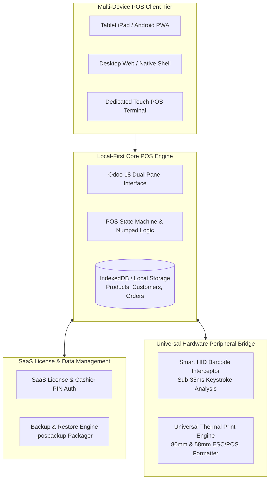

# Software Requirements Specification (SRS)
## Universal Point of Sale (POS) System (Odoo 18 Enterprise Clone & SaaS Platform)

**Document Version:** 1.0.0  
**Date:** July 14, 2026  
**Status:** Approved Specification  

---

## 1. Introduction

### 1.1 Purpose
This Software Requirements Specification (SRS) defines the comprehensive functional, non-functional, architectural, and hardware integration requirements for the **Universal Point of Sale (POS) System**. This platform provides retail stores, restaurants, and enterprises with an exact replica of the **Odoo 18 Point of Sale** interface while extending its capabilities into a multi-device SaaS product.

### 1.2 Scope
The Universal POS System is designed to run self-hosted or distributed across three primary deployment environments:
1. **Tablets (iPad / Android)**: Touch-first responsive PWA with swipe navigation and large touch targets.
2. **Desktop / Laptop Workstations**: Web browser or desktop client with physical keyboard hotkeys and dual-pane split view.
3. **Dedicated POS Hardware Terminals**: Integrated touchscreen registers connected to barcode scanners, thermal receipt printers, and cash drawers.

### 1.3 Key Differentiators
- **Offline-First Local Resilience**: Functions continuously with zero internet connectivity using client-side IndexedDB database caching.
- **Duration-Based SaaS Subscription Licensing**: Built-in cryptographic license verification supporting trial periods, duration-based subscriptions, and automated expiry countdowns.
- **1-Click Database Backup & Restore**: Universal `.posbackup` packaging for instant store data migration and disaster recovery.
- **Zero-Config Universal Hardware Engine**: Automatic detection of barcode scanners and switchable 80mm / 58mm thermal receipt printers.

---

## 2. Overall System Architecture



---

## 3. Functional Requirements

### 3.1 Core POS Operations (Odoo 18 Clone Engine)

#### FR-1.1: Dual-Pane Interface Layout
- **Description**: The interface shall present an order ticket pane on the left (approx. 38–42% screen width) and a categorized product catalog on the right (approx. 58–62% screen width).
- **Acceptance Criteria**:
  - Left pane displays selected customer, itemized order lines, subtotal/tax/total summary, and multi-mode numeric keypad.
  - Right pane displays search input, horizontal category chips, and responsive product cards with price tags and stock indicators.

#### FR-1.2: Iconic Multi-Mode Numeric Keypad (`Qty`, `% Disc`, `Price`, `+/-`)
- **Description**: The numeric keypad shall operate in modal states dictated by the active tab selector.
- **Acceptance Criteria**:
  - **Qty Mode (Default)**: Typing digits replaces or modifies the quantity of the active line item.
  - **% Disc Mode**: Typing digits applies a percentage discount (0% to 100%) to the active line item.
  - **Price Mode**: Typing digits overrides the unit selling price of the active line item.
  - **+/- Mode**: Toggles positive/negative item quantity for returns and refunds.
  - **Backspace**: Removes the last digit or deletes the line item if quantity reaches zero.

#### FR-1.3: Concurrent Held Orders Management
- **Description**: The system shall support multiple concurrent active transactions ("Order 1", "Order 2 - Table 4").
- **Acceptance Criteria**:
  - Cashiers can open new order tabs without losing active order state.
  - Each order tab preserves its own line items, assigned customer, order notes, and tender calculations.

#### FR-1.4: Payment Register & Thermal Receipt Preview
- **Description**: The checkout screen shall support split tender methods and render realistic thermal receipts.
- **Acceptance Criteria**:
  - Payment methods supported: **Cash**, **Bank / Card Terminal**, **Customer Account / Credit**, **Gift Card**.
  - Quick tender buttons (`+$10`, `+$20`, `+$50`, `Exact`) and live change calculation.
  - Order validation generates a thermal receipt preview with store details, tax breakdown, order reference, and barcode.

---

### 3.2 Duration-Based SaaS Subscription & Authentication (SaaS Engine)

#### FR-2.1: Client Subscription & License Key Verification
- **Description**: The system shall verify store licensing before permitting POS operations.
- **Acceptance Criteria**:
  - License structure stores: `StoreName`, `ClientTaxID`, `LicenseKey`, `PlanTier`, `ExpiryTimestamp`, `Signature`.
  - Supports Duration Plans: **14-Day Free Trial**, **30-Day Monthly**, **365-Day Annual**.
  - Displays remaining active days badge in the header bar (`Pro License: 286 Days Left`).

#### FR-2.2: Offline Grace Period & Expiry Lockout
- **Description**: The system shall protect against unauthorized use after subscription expiration while tolerating temporary network outages.
- **Acceptance Criteria**:
  - Validates cryptographic signature locally without requiring continuous internet connectivity.
  - If a license is expired, the POS interface transitions to a **License Renewal Lock Screen**, preventing new order creation until a valid renewal key is entered.

#### FR-2.3: Role-Based Access Control & Cashier PIN Switching
- **Description**: Stores shall support multiple cashier profiles secured by PIN authentication.
- **Acceptance Criteria**:
  - **Store Admin**: Full access to hardware configuration, license management, backup/restore, and register closeout.
  - **Cashier Access**: Fast 4-digit PIN lock screen (`1234`) enabling cashiers to lock/unlock the terminal between shifts while logging transaction ownership.

---

### 3.3 Complete Local Database Backup & Restore (Data Resilience Engine)

#### FR-3.1: 1-Click Full Database Snapshot Export (`.posbackup`)
- **Description**: Admins shall be able to export the complete local POS database into a single, structured backup file.
- **Acceptance Criteria**:
  - Export package contains: Product Catalog, Categories, Customer Accounts, Active/Completed Transactions, Store Settings, License State, and Cash Register History.
  - File format: Standardized `.posbackup` (SHA-256 integrity-verified JSON/IndexedDB dump).
  - Triggered manually from Settings or optionally on session closeout.

#### FR-3.2: 1-Click Database Restore & Device Migration
- **Description**: The system shall restore a complete store database from any valid `.posbackup` file.
- **Acceptance Criteria**:
  - Uploading a `.posbackup` file validates schema integrity and checksum.
  - Overwrites or merges local database state and refreshes the UI within <2 seconds, enabling instant tablet/terminal replacement or store data cloning.

---

### 3.4 Zero-Config Universal Hardware Engine (Peripherals Layer)

#### FR-4.1: Smart Universal Barcode Scanner Interceptor
- **Description**: The application shall auto-detect barcode scanner inputs without requiring manual USB/COM driver installation or input focus.
- **Acceptance Criteria**:
  - Implements a global keystroke listener monitoring inter-keystroke intervals.
  - **Detection Threshold**: Keystroke sequences where characters arrive `<35 milliseconds` apart ending in `Enter` or `Tab` are classified as hardware barcode scanner input.
  - Automatically searches SKU/barcode matching the scan and inserts the product into the active order ticket, regardless of cursor focus.

#### FR-4.2: Universal Switchable Thermal Printer Engine (80mm & 58mm)
- **Description**: The POS shall generate responsive thermal receipts compatible with any receipt printer.
- **Acceptance Criteria**:
  - Admins can toggle receipt paper formatting between **80mm (Standard 3-Inch Retail)** and **58mm (Compact 2-Inch Mobile)**.
  - **Universal Print Bridge**: Formats print layout using CSS `@media print` rules tailored to thermal rolls, ensuring 100% compatibility across USB, LAN, Bluetooth, or OS-installed system printers.
  - **ESC/POS Hardware Trigger**: Support for raw ESC/POS pulse generation (`ESC p 0 50 250`) to trigger RJ11 cash drawers.

---

## 4. Non-Functional Requirements (NFRs)

| ID | Category | Requirement Description |
| :--- | :--- | :--- |
| **NFR-1** | **Offline Availability** | The POS must remain fully functional during internet outages. Local catalog queries and order creation must complete with zero network latency. |
| **NFR-2** | **Performance** | UI interactions (adding line items, keypad mode switching, barcode scans) must respond within **<16 milliseconds** (60 FPS rendering). |
| **NFR-3** | **Data Integrity** | All financial transactions and stock counters must use IEEE 754 fixed-point or cent-based precision arithmetic to eliminate floating-point rounding errors. |
| **NFR-4** | **Touch Ergonomics** | Interactive UI elements on touch devices must meet a minimum hit area of **44×44 CSS pixels** to prevent accidental misclicks on tablets and POS monitors. |
| **NFR-5** | **Cross-Platform Compatibility** | Must execute consistently on Windows 10/11, macOS, Android 10+, iPadOS 15+, and Chromium/WebKit browsers. |

---

## 5. System Interfaces & Data Schema

### 5.1 License & Subscription Data Schema
```json
{
  "licenseId": "LIC-2026-9941",
  "clientName": "Odoo Flagship Retail",
  "planTier": "ENTERPRISE_ANNUAL",
  "issuedAt": "2026-07-14T00:00:00Z",
  "expiresAt": "2027-07-14T23:59:59Z",
  "maxTerminals": 5,
  "status": "ACTIVE",
  "signature": "SHA256:4f8a9e2b1c3d..."
}
```

### 5.2 Backup Archive Structure (`.posbackup`)
```json
{
  "manifest": {
    "version": "1.0.0",
    "timestamp": "2026-07-14T18:45:00Z",
    "storeName": "Odoo Retail Flagship",
    "checksum": "e3b0c44298fc1c149afbf4c8996fb92427ae41e4649b934ca495991b7852b855"
  },
  "data": {
    "storeInfo": { "...": "..." },
    "categories": [ ],
    "products": [ ],
    "customers": [ ],
    "orders": [ ],
    "cashSessions": [ ]
  }
}
```

---

## 6. Verification & Acceptance Checklist

- [ ] **Dual-Pane Layout**: Left order ticket and right catalog render correctly across Tablet (1024px) and Desktop (1920px) resolutions.
- [ ] **Keypad Modes**: Verify switching between `Qty`, `% Disc`, and `Price` correctly overrides active line item properties.
- [ ] **SaaS License Expiry**: Test license dates to ensure system warns at `<14 days` and locks order entry when expired.
- [ ] **Backup/Restore Roundtrip**: Export `.posbackup`, clear local state, import `.posbackup`, and verify 100% data recovery.
- [ ] **Universal Scanner Interception**: Rapidly type any product barcode followed by `Enter` without focusing the search bar; verify product is added to cart instantly.
- [ ] **Thermal Print Formatting**: Switch between `80mm` and `58mm` and verify receipt header, itemized rows, barcode, and margins format correctly.
