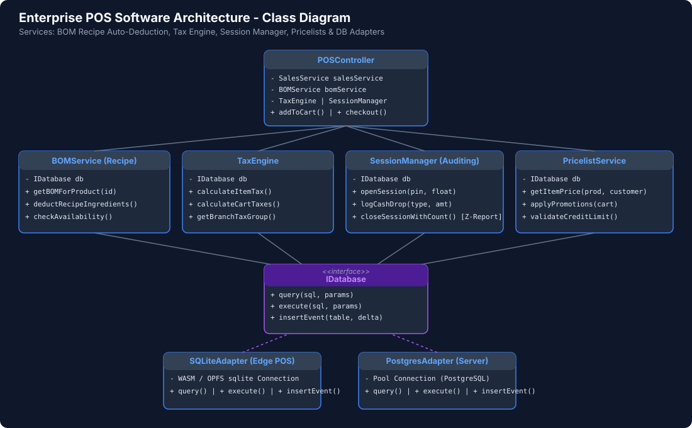
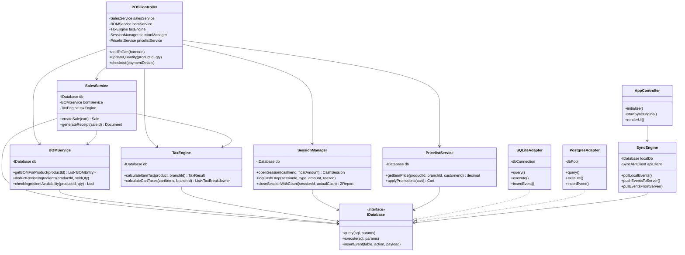

# Class Diagram

This class diagram details the software architecture, including services for Bill of Materials (BOM) Auto-Deduction, Multi-Tax Calculation, Cash Session Auditing, Pricelist Management, and Event Sourcing Synchronization.

---

### Mermaid Specification

