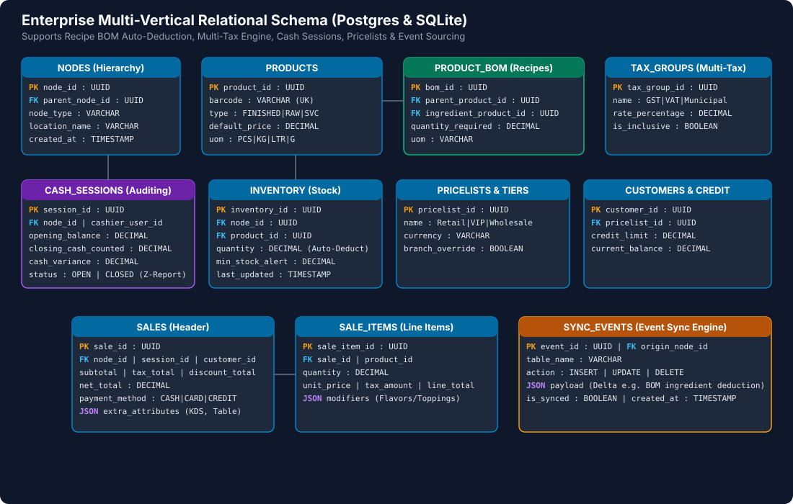
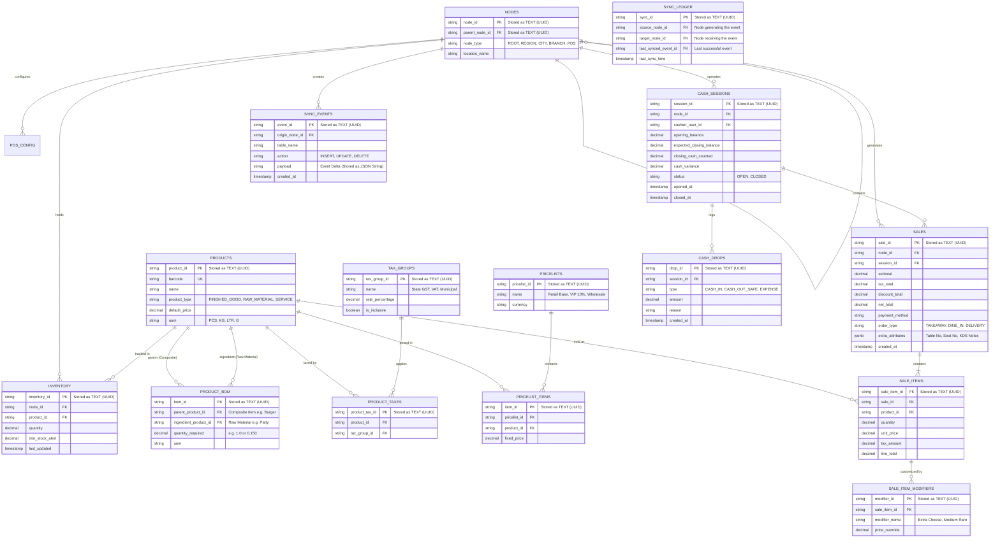

# Enterprise Database Schema & Data Models

This document defines the relational database schema implemented across **PostgreSQL (Servers)** and **SQLite (Edge Terminals)**. It natively supports Bill of Materials (BOM) raw material tracking, multi-tax engines, cash sessions, multi-tier pricelists, and event-sourcing sync.

---

## Entity Relationship Diagram (ERD)

