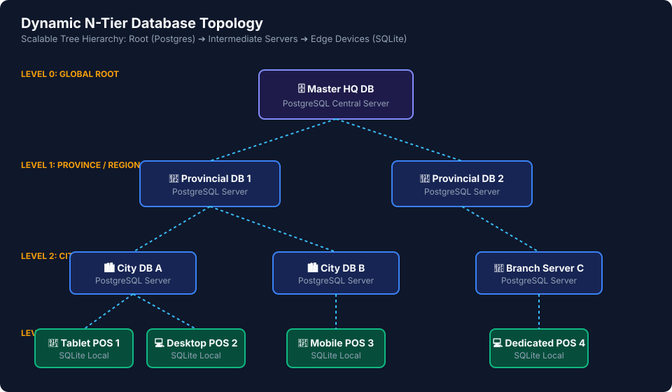
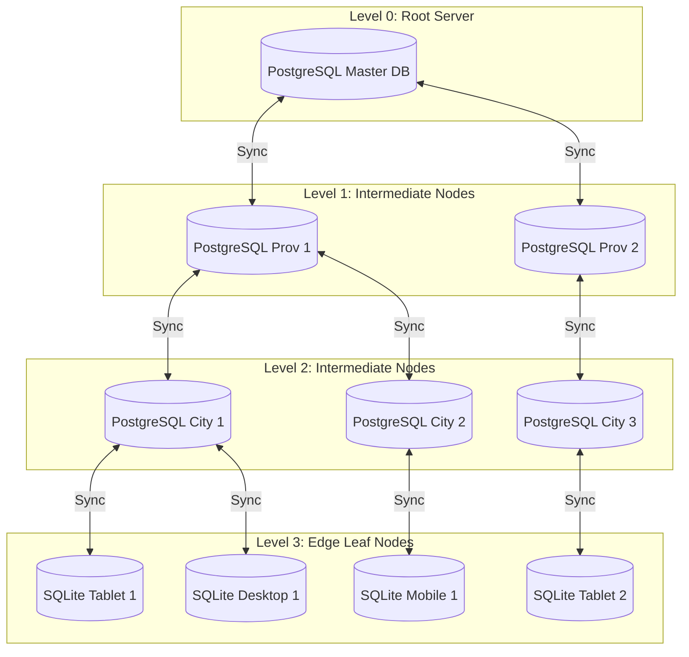
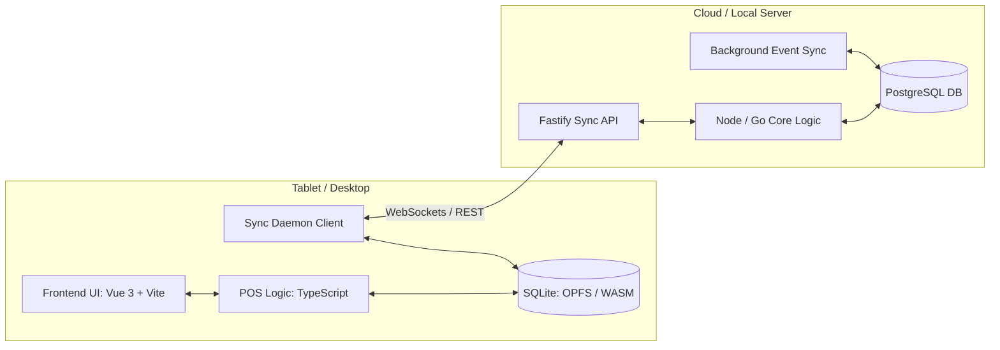

# System Architecture

## N-Tier Dynamic Hierarchy

The database architecture is designed as a dynamic, N-tier tree. There are no hardcoded levels (like "City" or "Province"). Instead, every server acts as a node that has exactly one **Parent** (except the Root) and zero-to-many **Children**.

---

### Mermaid Topology Specification

---

## Component Architecture per Node

Every Node (whether a heavy PostgreSQL server or a light SQLite edge device) runs a similar stack, optimized for its hardware.

---

## Production Tech Stack Specification

### 1. Frontend POS Client Tier (Cross-Platform)
* **UI Framework**: **Vue 3 (Composition API) + TypeScript + Vite**
  * *Rationale*: High performance (<16ms, 60fps rendering), lightweight memory footprint for tablets, identical reactive architecture to Odoo 17/18's Owl framework.
* **Target Wrappers**:
  * **PWA (Progressive Web App)**: Instant web deployment for iPad Safari and Android Chrome registers.
  * **Tauri Framework**: Lightweight native desktop app wrapper (~15MB RAM) for Windows, macOS, and Linux POS terminals.
  * **Capacitor**: Optional wrapper for iOS/Android native app store distribution.

### 2. Database & Data Access Tier (Standard SQL)
* **Edge Terminal Database**: **SQLite (via `@sqlite.org/sqlite-wasm` + OPFS)**
  * *Rationale*: Runs native SQLite inside browser/desktop, persisting actual `.sqlite` database files queryable directly via DBeaver.
* **Server Database (Branch, City, Province, Root Nodes)**: **PostgreSQL**
  * *Rationale*: Enterprise relational database, fully queryable via DBeaver, DataGrip, or pgAdmin.
* **Query Engine**: **Drizzle ORM** / **Kysely**
  * *Rationale*: Type-safe SQL query builder providing a single unified API across both SQLite and PostgreSQL.

### 3. Backend & Event Sync Tier
* **Server Runtime**: **Node.js (TypeScript) + Fastify** *(or Golang compiled binary)*
* **Real-time Sync Transport**: **WebSockets (`ws`)** with HTTP REST fallback for polling `SYNC_EVENTS`.

### 4. Peripherals & Hardware Integration
* **Thermal Receipt Printers**: ESC/POS formatter outputting over WebUSB, Web Serial, LAN, or Bluetooth.
* **Barcode Scanners**: Global JS inter-keystroke listener with `<35ms` detection threshold.
