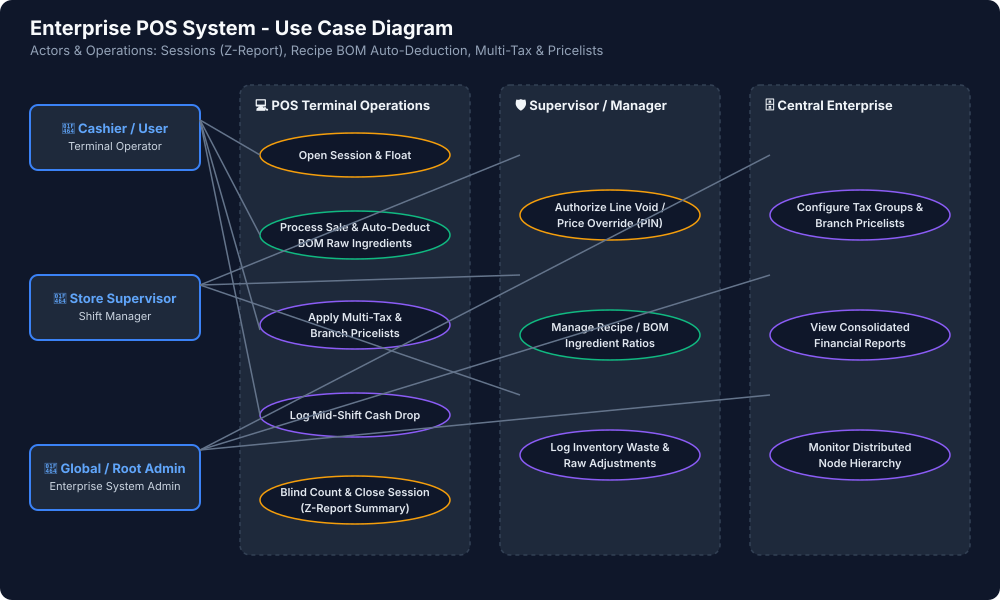
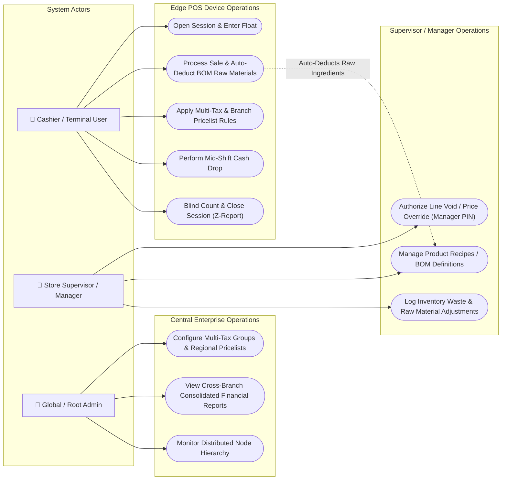

# Use Case Diagram

This diagram maps human actors (`Cashier`, `Store Supervisor / Manager`, `Global Admin`) to core system operations including Cash Session Management (Z-Report), Recipe/BOM Auto-Deduction, Multi-Tax calculation, and Branch Pricelists.

---

### Mermaid Specification

